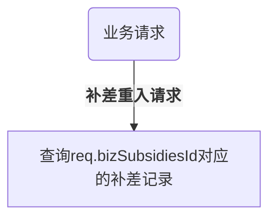
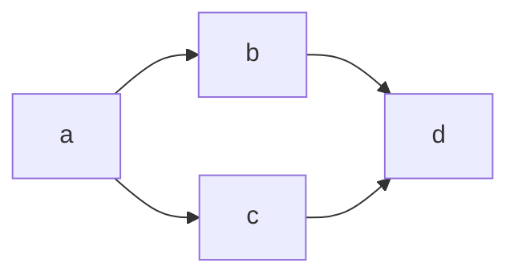

```json
{"traceId":"10202502d63adaf1c99dfd90ca250d1cacc093f5","timestamp":1740125261,"productId":1107,"tenantId":11,"userId":"550836211","bizOrderId":"10202502d63adaf1c99dfd90ca250d1cacc093f5"}
```

- 营销补差重入场景
	- 请求超时
		- 第一次请求超时，第二次报不满足补差条件错误（占大多数）
	- 重入键
		- bizSubsidiesId
- 营销补差回退
	- 请求超时
	- 重入条件
		- 重入键
			- PaymentRefundId
			- BizReturnSubsidiesId
				- BizReturnSubsidiesId和amount必须一一对应
		- Amount再次校验
- 测试用例
	- 已经补差成功的单，请求创建补差
		- 返回成功
	- 补差重入 参数校验失败
		- 返回参数校验失败错误
	- 补差失败的单重入
		- 继续进行创建补差操作
	- 补差回退成功 重入
		- 返回成功
	-  补差回退失败 重入
		- 继续进行补差回退
	- 补差回退重入 参数校验失败
		- 返回参数校验失败错误


- 已经补差成功的单，请求创建补差
```json
{
	"traceId": "{{orderno}}",
	"timestamp": {{timestamp_s}},
	"productId": 1096,
	"tenantId": 0,
	"userId": "1295659",
	"bizOrderId": "1774303629096779780_1",
	"paymentOrderId": "1326216474909544770",
	"bizRelOrderId": "1329128496286412800_0",
	"bizSubsidiesId": "1329128824390000640",
	"amount": 2332,
	"description": "补差描述1",	
	"mchId": "1800007135",
	"subMchId": "1692608207"
}

{
	"code": 0,
	"data": {
	"amount": 2332,
	"bizOrderId": "1774303629096779780_1",
	"bizRelOrderId": "1329128496286412800_0",
	"bizSubsidiesId": "1329128824390000640",
	"description": "嘀嗒优惠卷补差",
	"mchId": "1800007135",
	"openid": "ou8xs5WjMpzd59eYy7JNF3CuLG0g",
	"paymentOrderId": "1326216474909544770",
	"paymentSubsidiesId": "1326216474909544771",
	"proxyChannelSubsidiesId": "40000307692025011501593491216",
	"subMchId": "1692608207",
	"tenantId": 0,
	"traceId": "60e1dec8139c00120b2f488bb17859f0",
	"userId": "1295659"
	},
	"message": "success"
}
```
- 补差重入 参数校验失败
```json
{
	"traceId": "{{orderno}}",
	"timestamp": {{timestamp_s}},
	"productId": 1096,
	"tenantId": 0,
	"userId": "1295659",
	"bizOrderId": "1769839878175981572_1",
	"paymentOrderId": "1326216474909544516",
	"bizRelOrderId": "1326948785179340800_0",
	"bizSubsidiesId": "1326949155943276544",
	"amount": 100,
	"description": "补差描述1",
	"mchId": "1800007135",
	"subMchId": "1692608207
}

{
	"code": 1030,
	"message": "请求重入参数校验失败
}
```
- 补差失败的单重入
	- 继续走了创建补差的逻辑
```json
{

	"traceId": "{{orderno}}",
	
	"timestamp": {{timestamp_s}},
	
	"productId": 1096,
	
	"tenantId": 0,
	
	"userId": "1295659",
	
	"bizOrderId": "1769839878175981572_1",
	
	"paymentOrderId": "1326216474909544516",
	
	"bizRelOrderId": "1326948785179340800_0",
	
	"bizSubsidiesId": "1326949155943276544",
	
	"amount": 500,
	
	"description": "补差描述1",
	
	"mchId": "1800007135",
	
	"subMchId": "1692608207"

}

{

	"code": 1030,
	
	"message": "ret of response is not zero: ret=3703 and err_code=3703-3703-0 and msg=系统繁忙，请稍后再试, wechat err: {\"code\":\"INVALID_REQUEST\",\"message\":\"对应的订单不能补差\"}"

}
```
- 补差回退成功 重入
```json
[{"state":1,"total_amount":2332,"biz_refund_id":"1329128835060391936","returned_amount":2332,"returning_amount":0,"payment_refund_id":"1326216474909544772","biz_return_subsidies_id":"1329128835244941312","payment_return_subsidies_id":"1326216474909544773","proxy_channel_return_subsidies_id":"41000307692025011501593502070"}]


{
	"traceId": "1295413502290092034_114",
	"timestamp": {{timestamp_s}},
	"productId": 1096,
	"userId": "1295659",
	"bizOrderId": "1774303629096779780_1",
	"paymentOrderId": "1326216474909544770",
	"bizRelOrderId": "1329128496286412800_0",
	"bizRefundId": "1329128835060391936",
	"paymentRefundId": "1326216474909544772",
	"bizReturnSubsidiesId": "1329128835244941312",
	"bizSubsidiesId": "1329128824390000640",
	"paymentSubsidiesId": "1326216474909544771",
	"amount": "2332",
	"description": "补差回退",
	"mchId": "1800007135",
	"subMchId": "1692608207"
}

{
		"code": 0,
		"data": {
			"amount": 2332,
			"bizOrderId": "1774303629096779780_1",
			"bizRelOrderId": "1329128496286412800_0",
			"bizReturnSubsidiesId": "1329128835244941312",
			"bizSubsidiesId": "1329128824390000640",
			"description": "嘀嗒优惠卷补差",
			"mchId": "1800007135",
			"openid": "",
			"paymentOrderId": "1326216474909544770",
			"paymentReturnSubsidiesId": "1326216474909544773",
			"paymentSubsidiesId": "1326216474909544771",
			"proxyChannelReturnSubsidiesId": "41000307692025011501593502070",
			"proxyChannelSubsidiesId": "",
			"subMchId": "1692608207",
			"tenantId": 0,
			"traceId": "2f4fa53e30fdfacfd867aa89b89bfb8c",
			"userId": "1295659"
		},
		"message": "success"
}
```
- 补差回退失败 重入







