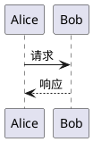
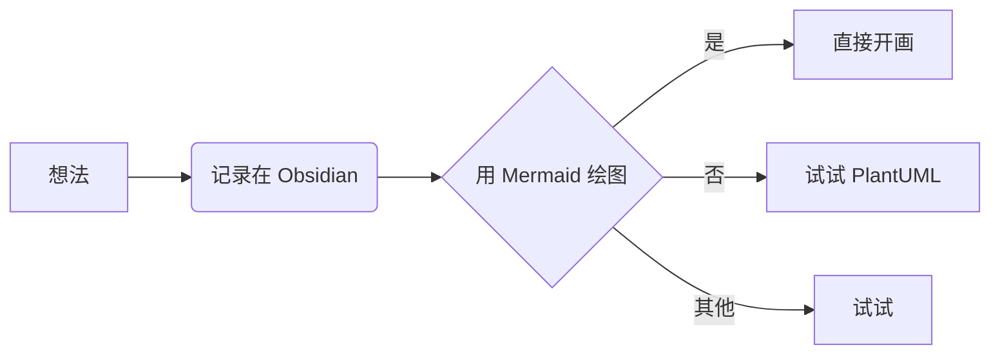

- [wiki链接](https://docs.midas.woa.com/midasweb-protodoc/protodoc/profit_sharing_order_svr/#%E8%AF%B7%E6%B1%82%E5%88%86%E8%B4%A6)
- [小时级分账文档](http://op.cbs.boss.com/assets/30037_doc_b0b473464bb616604c713198419300b6.html#3v2uploadcustom_data-customid-notify_profit?code=TOF4TeyJrZXkiOiJIMkdYM2N1Z3d6MkRBNTNDRExsQmhjcGk5WUNxYkpXaCIsImlzcyI6IjEwLjg4LjE3Ny4xNCIsImhrIjoiIiwiYXVkIjoibmduIiwiaGFzaCI6IjA0RThBN0JBMTcwQUNDRTNBOUJFREVGMjFDQUYzOTkyRkQ3MUE3Qzg0NTk3RjU2NTNBMUVCRjg2OUQxRjE1QTAiLCJuaCI6IkI3REIwNUYzMTM2N0ZFRTE5RjgzMTYyQTE3RTgyQkI3MkVBN0E1RTE3MEI2OEI2NEFCRkRBNzg3QzM4NzdENkUifQ)
- 请求分账
	- 触发途径
		- 打车
			- 支付成功事件
			- 业务主动触发
		- 其他业务
			- 订单事件
			- 业务主动触发
	- 配置读取
		- 历史-> 根据productid+spid读取
		- 无法兼容接入米大师渠道后，同一个spid可能对应多条分账配置（不同渠道）的场景
		- 最新方案-> 根据proxychannel对spid做临时转换，productid+temp_spid读取

- 查询分账
- 请求分账回退
- 查询分账回退
