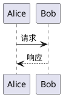
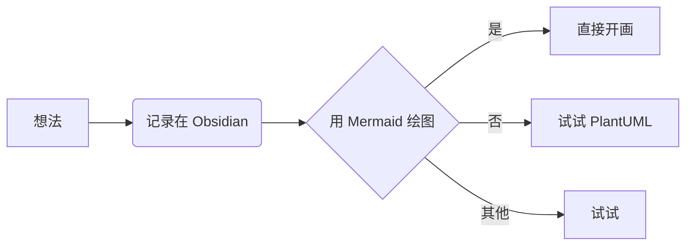
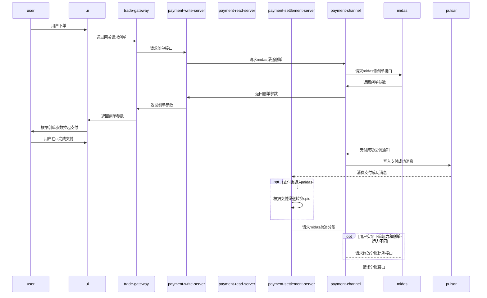

- [wiki链接](https://docs.midas.woa.com/midasweb-protodoc/protodoc/profit_sharing_order_svr/#%E8%AF%B7%E6%B1%82%E5%88%86%E8%B4%A6)
- [小时级分账文档](http://op.cbs.boss.com/assets/30037_doc_b0b473464bb616604c713198419300b6.html#3v2uploadcustom_data-customid-notify_profit?code=TOF4TeyJrZXkiOiJIMkdYM2N1Z3d6MkRBNTNDRExsQmhjcGk5WUNxYkpXaCIsImlzcyI6IjEwLjg4LjE3Ny4xNCIsImhrIjoiIiwiYXVkIjoibmduIiwiaGFzaCI6IjA0RThBN0JBMTcwQUNDRTNBOUJFREVGMjFDQUYzOTkyRkQ3MUE3Qzg0NTk3RjU2NTNBMUVCRjg2OUQxRjE1QTAiLCJuaCI6IkI3REIwNUYzMTM2N0ZFRTE5RjgzMTYyQTE3RTgyQkI3MkVBN0E1RTE3MEI2OEI2NEFCRkRBNzg3QzM4NzdENkUifQ)
- 请求分账
	- 触发途径
		- 打车
			- 支付成功事件
			- 业务主动触发
			- 分账获取proxy_channel信息
		- 其他业务
			- 订单事件
			- 业务主动触发
			- 分账获取proxy_channel信息
	- 配置读取
		- 历史-> 根据productid+spid读取
		- 无法兼容接入米大师渠道后，同一个spid可能对应多条分账配置（不同渠道）的场景
		- 最新方案-> 根据proxychannel对spid做临时转换，productid+temp_spid读取








- 查询分账
- 请求分账回退
- 查询分账回退
- 改动点
	- 支付读服务
		- 支付分读取新增proxy_channel字段，改了八个接口
		- 支付分 v1&v2
			- query
			- query_rel
		- 普通订单 v1&v2
			- query
			- query_rel
		- pay_score_model pb协议修改
		```yaml
		 <dependency> <artifactId>PaymentCenter-stub</artifactId> <groupId>com.tencent.trade.payment.stub.model.payscore</groupId> <version>1.2.1</version> </dependency>
		```
	- 支付写服务
		- 支付分单新增proxy_channel字段
	- 结算服务
		- v1&v2 渠道结算透传proxy_channel
		- spid根据proxy_channel进行转换，读取对应的分账配置
		- 
- 调试
	- 支付分单

	``` 
	"bizOrderId": "willhao1739520361",
	"openid": "oYAz6vh9xGHCEzbWJmDUYdfsOT3c",
	"subOpenid": "ou8xs5Ypgt_fo-hqfkZOHvIAZEWY",
	"userId": "1262012"
	"spId": "6",
	"subMchId": "1700906989",
	paymentOrderId=1337814806777835551
	```

- 初步调试目前卡点
	- 支付回调流程还没通，导致分账缺失一些必要参数
	- 米大师小时级分账不支持沙箱环境

- 2.27卡点
	- 
	- 只有一个分账接收方时，查询分账信息没有 子商户的分账信息，需要自己补齐兼容
	- 多方分账时，需要修改分账请求方式，具体格式如下
	-
```java
for (SharingReceiverResp item : resp.getReceivers()) {  
    TProfitSharingInfo profitSharingInfo = TProfitSharingInfo.builder()  
            .amount(item.getAmount())  
            .description(item.getDescription())  
            .receiveType(item.getType()).wxSharingOrderId(resp.getOrderId())  
            .wxSharingDetailId(item.getDetailId()).failReason(item.getFailReason())  
            .state(Objects.requireNonNull(SettlementStateEnum.fromState(item.getResult())).getCode())  
            .finishTime(DateUtils.stringToTimeMillSecond(item.getFinishTime()))  
            .sharingOrderId(resp.getOutOrderNo()).receiveMchId(item.getAccount())  
            .build();  
    profitSharingInfo.setTradeId(tradeId);  
    tProfitSharingInfoMapper.updateSelectiveByTradeSharingOrderReceiveMchId(profitSharingInfo);  
}
```

![[企业微信截图_5ccea730-02d6-43f0-804c-dd16e8351b0b.png]]
- 米大师多方分账请求
```
场景一：1个分账+解冻
date：2025-02-28
out_trade_no：order1
receiver_account：180001
profit_sharing_id：order1_180001
profit_sharing_amt：6
is_finish：1
场景二：2个分账，1个解冻
date：2025-02-28
out_trade_no：order2
receiver_account：180001
profit_sharing_id：order2_180001
profit_sharing_amt：7
is_finish：0
date：2025-02-28
out_trade_no：order2
receiver_account：180002
profit_sharing_id：order2_180002
profit_sharing_amt：5
is_finish：0
date：2025-02-28
out_trade_no：order2
other_profit_sharing_ids：order2_180001,order2_180002
is_finish：1
```