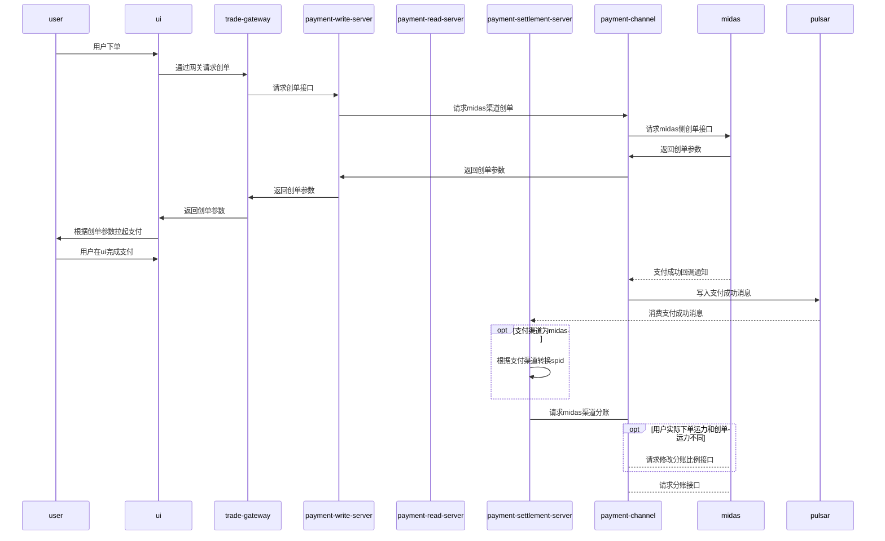

- [wiki链接](https://docs.midas.woa.com/midasweb-protodoc/protodoc/profit_sharing_order_svr/#%E8%AF%B7%E6%B1%82%E5%88%86%E8%B4%A6)
- [小时级分账文档](http://op.cbs.boss.com/assets/30037_doc_b0b473464bb616604c713198419300b6.html#3v2uploadcustom_data-customid-notify_profit?code=TOF4TeyJrZXkiOiJIMkdYM2N1Z3d6MkRBNTNDRExsQmhjcGk5WUNxYkpXaCIsImlzcyI6IjEwLjg4LjE3Ny4xNCIsImhrIjoiIiwiYXVkIjoibmduIiwiaGFzaCI6IjA0RThBN0JBMTcwQUNDRTNBOUJFREVGMjFDQUYzOTkyRkQ3MUE3Qzg0NTk3RjU2NTNBMUVCRjg2OUQxRjE1QTAiLCJuaCI6IkI3REIwNUYzMTM2N0ZFRTE5RjgzMTYyQTE3RTgyQkI3MkVBN0E1RTE3MEI2OEI2NEFCRkRBNzg3QzM4NzdENkUifQ)
- 请求分账
	- 触发途径
		- 打车
			- 支付成功事件
			- 业务主动触发
			- 分账获取proxy_channel信息
		- 其他业务
			- 订单事件
			- 业务主动触发
			- 分账获取proxy_channel信息
	- 配置读取
		- 历史-> 根据productid+spid读取
		- 无法兼容接入米大师渠道后，同一个spid可能对应多条分账配置（不同渠道）的场景
		- 最新方案-> 根据proxychannel对spid做临时转换，productid+temp_spid读取



- 查询分账
- 请求分账回退
- 查询分账回退
- 改动点
	- 支付读服务
		- 支付分读取新增proxy_channel字段，改了八个接口
		- 支付分 v1&v2
			- query
			- query_rel
		- 普通订单 v1&v2
			- query
			- query_rel
		- pay_score_model pb协议修改
		```yaml
		 <dependency> <artifactId>PaymentCenter-stub</artifactId> <groupId>com.tencent.trade.payment.stub.model.payscore</groupId> <version>1.2.1</version> </dependency>
		```
	- 支付写服务
		- 支付分单新增proxy_channel字段
	- 结算服务
		- v1&v2 渠道结算透传proxy_channel
		- spid根据proxy_channel进行转换，读取对应的分账配置
		- 
- 调试
	- 支付分单

``` 
	"bizOrderId": "willhao1739520361",
	"openid": "oYAz6vh9xGHCEzbWJmDUYdfsOT3c",
	"subOpenid": "ou8xs5Ypgt_fo-hqfkZOHvIAZEWY",
	"userId": "1262012"
	"spId": "6",
	"subMchId": "1700906989",
	paymentOrderId=1337814806777835551


	1346568762341523781
	willhao1741316890
	"subAppId": "wx65cc950f42e8fff1",
	"subOpenId": "ou8xs5Ypgt_fo-hqfkZOHvIAZEWY"
	"userId": "1262012",

```

- 初步调试目前卡点
	- 支付回调流程还没通，导致分账缺失一些必要参数
	- 米大师小时级分账不支持沙箱环境

- 2.27 卡点
	- 只有一个分账接收方时，查询分账信息没有 子商户的分账信息，需要自己补齐兼容
	- 多方分账时，需要修改分账请求方式，具体格式如下
- 3.4 卡点
	- 米大师结算使用支付分创单金额做校验，没有感知到完单金额的变化，也不知道实际参与佣金计算的金额是多少（米大师是不是可以放开金额校验逻辑？）
	- 一个订单有多笔支付，例子 支付分10元 普通支付2元，实际参与佣金计算金额10元，可能没有办法严格按照   分账金额=订单金额\*分佣比例
	- 网约车附加费不参与分佣，这个米大师无法感知
	
```java
for (SharingReceiverResp item : resp.getReceivers()) {  
    TProfitSharingInfo profitSharingInfo = TProfitSharingInfo.builder()  
            .amount(item.getAmount())  
            .description(item.getDescription())  
            .receiveType(item.getType()).wxSharingOrderId(resp.getOrderId())  
            .wxSharingDetailId(item.getDetailId()).failReason(item.getFailReason())  
            .state(Objects.requireNonNull(SettlementStateEnum.fromState(item.getResult())).getCode())  
            .finishTime(DateUtils.stringToTimeMillSecond(item.getFinishTime()))  
            .sharingOrderId(resp.getOutOrderNo()).receiveMchId(item.getAccount())  
            .build();  
    profitSharingInfo.setTradeId(tradeId);  
    tProfitSharingInfoMapper.updateSelectiveByTradeSharingOrderReceiveMchId(profitSharingInfo);  
}
```
```
2025-03-03 16:58:56.263 INFO    midas/refund.go:56      midas.Refund.Apply: req=&{OfferId:1450233542 ReqFrom:2 OpenId: SessionId:wechatid OutTradeNo:T1344672824052219908 Amt:380 RefundId:1344683518105550850 RefundReason:1 Deductar:0 UseOriRefundId:0 RefundAccount: FundsAccount: SubOutTradeNoList: RefundProductMode: ProductList: TS:1740992336194 Sig:yF/anQYDvidmeqHIxBRc6XR7v5g=}, body=map[amt:[380] offer_id:[1450233542] out_trade_no:[T1344672824052219908] refund_id:[1344683518105550850] refund_reason:[1] req_from:[2] session_id:[wechatid] sig:[yF/anQYDvidmeqHIxBRc6XR7v5g=] ts:[1740992336194]], resp=&{Ret:1001 ErrCode:1001-1001-0 Msg:系统繁忙，请稍后再试 Details:[]}, err=<nil>    {"traceID": "1ad0b846dd5d10a58cf00f201076bc98", "spanID": "683c116e1abebf76", "sampled": "true"}

oYAz6voZm48vJSrgiUNAffHCfPJs
```

各种结论
- mock 沙箱支付单数据 http://op.cbsx.boss.com/assets/30037_doc_include_test_aad8b1a9734699318238eb441f9b63f5.html#11v2uploadcustom_data-customid-pay_order

- 网约车业务是按照账单维度做的分账，用户实际支付1200（支付分支付1000，普通支付200），参与佣金计算金额 1000，分账比例按照10%算，业务实际佣金100；这个时候两笔支付单的分佣是随机的，另一个会等待前一笔分账完成，比如先做了200订单的分佣，会按照正常的请求20佣金，第二笔过来 会根据实际总分佣金额和历史分佣金额计算，1000的单只需要再分佣80
- 只有一个分账接收方时，查询分账信息没有 子商户的分账信息，需要自己补齐兼容
- 多方分账时，需要修改分账请求方式，具体格式如下
- 分账退款解耦
- 分账接收方绑定
- 子商户是否需要请求分账回退？
- 账单维度部分退款，通知的baseAmount该如何修改
	- 还要考虑部分退款后，剩余金额-佣金-手续费 < 0 的情况

![[企业微信截图_5ccea730-02d6-43f0-804c-dd16e8351b0b.png]]
- 米大师多方分账请求
```
场景一：1个分账+解冻
date：2025-02-28
out_trade_no：order1
receiver_account：180001
profit_sharing_id：order1_180001
profit_sharing_amt：6
is_finish：1
other_profit_sharing_ids：
场景二：2个分账，1个解冻
date：2025-02-28
out_trade_no：order2
receiver_account：180001
profit_sharing_id：order2_180001
profit_sharing_amt：7
is_finish：0
date：2025-02-28
out_trade_no：order2
receiver_account：180002
profit_sharing_id：order2_180002
profit_sharing_amt：5
is_finish：0
date：2025-02-28
out_trade_no：order2
other_profit_sharing_ids：order2_180001,order2_180002
is_finish：1
```


修改分账比例接口最新格式
```
 {
        "profit_base_amt": 100,
        "profit_rate": [
            {
                "receiver_account": "1450001",
                "rate": "0.1"
            },
            {
                "receiver_account": "1450002",
                "rate": "0.2"
            }
        ]
    }
```

![[Pasted image 20250306103121.png]]

分账退款解耦

确认下为什么会有这个逻辑
![[Pasted image 20250306212634.png]]

获取 sharing_comfirm


```java
List<MidasServerPB.ProfitSharingCreateOrderRequestData> list = new ArrayList<>();  
String defaultIsFinish = req.getReceivers().size() > 2 ? "0" : "1";  
for (SharingReceiver receiver : req.getReceivers()) {  
    // 只要分账接收方，分账出资方不要  
    if (Objects.equals(req.getSubMchId(), receiver.getAccount())) {  
        if (req.getReceivers().size() > 2){  
            list.add(MidasServerPB.ProfitSharingCreateOrderRequestData.newBuilder()  
                    .setProfitSharingAmt(receiver.getAmount().toString())  
                    .setOutTradeNo("T"+req.getPaymentOutTradeNo())  
                    .setIsFinish("1")  
                    .setReceiverAccount(receiver.getAccount())  
                    .build());  
        }  
        continue;  
    }  
    list.add(MidasServerPB.ProfitSharingCreateOrderRequestData.newBuilder()  
            .setProfitSharingAmt(receiver.getAmount().toString())  
            .setOutTradeNo("T"+req.getPaymentOutTradeNo())  
            .setIsFinish(defaultIsFinish)  
            .setReceiverAccount(receiver.getAccount())  
            .build());  
}  
MidasServerPB.ProfitSharingCreateOrderRequest request = MidasServerPB.ProfitSharingCreateOrderRequest.newBuilder()  
        .setRequestId(seqId)  
        .setTimestamp(System.currentTimeMillis())  
        .addAllData(list)  
        .build();  
MidasServerPB.ProfitSharingCreateOrderResponse response = midasProfitSharingProxy.CreateProfitSharingOrder(request);
```

```
	ExecuteStatusInit = 0
	ExecuteStatusSucc = 2
	ExecuteStatusFail = 3
{ "profit_base_amt": 20,"profit_rate": [{  "receiver_account": "1800009755",   "rate": "0.06" }]}  
```

```
1346568762341523889  willhao1741660123
1346568762341523893
"bizOrderId": "willhao1741678821",

1346568762341523894 willhao1741679109

1346568762341523895 willhao1741680727

分账比例为0
willhao1741682391   1346568762341523896
willhao1741684703 1349068780310978560
willhao1741685826 1349068780310978561
```